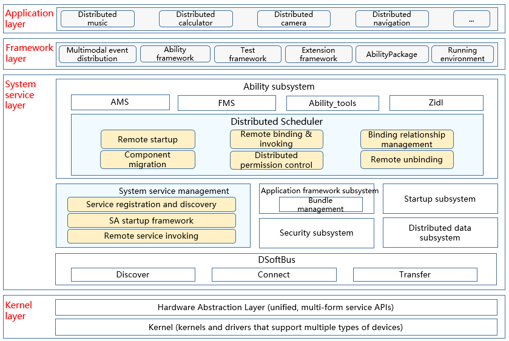

# dmsfwk

## Introduction

The Distributed Ability Manager Service Framework (dmsfwk) component is used for cross-device component management. It allows the local device to access and control remote components, and enables application collaboration in distributed scenarios. Major functions are as follows:

-   Remote ability startup: starts an ability on a remote device. Data can be returned when the Page ability ends.
-   Ability continuation: continues an ability on a remote device.
-   Remote ability binding: binds an ability on a remote device.
-   Remote call: obtains the caller interface of a remote ability to call the ability across devices.

## System Architecture

Figure 1 Architecture of dmsfwk




## Directory Structure

```
/foundation/ability
├── dmsfwk              # dmsfwk
│  ├── bundle.json      # Description and build script of dmsfwk
│  ├── etc              # Configuration files
│  ├── interfaces       # APIs exposed externally
│  ├── services         # Service implementation
│  ├── sa_profile       # SA-related configuration files
│  ├── utils            # Utils
```

## Repositories Involved

dmsfwk

[**ability\_dmsfwk**](https://gitee.com/openharmony/ability_dmsfwk)

[ability\_dmsfwk\_lite](https://gitee.com/openharmony/ability_dmsfwk_lite)
