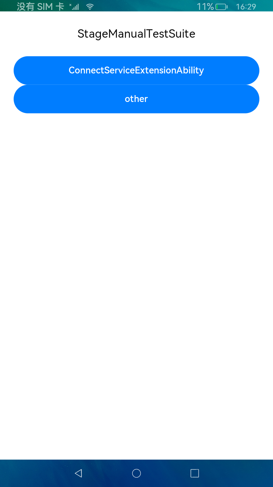
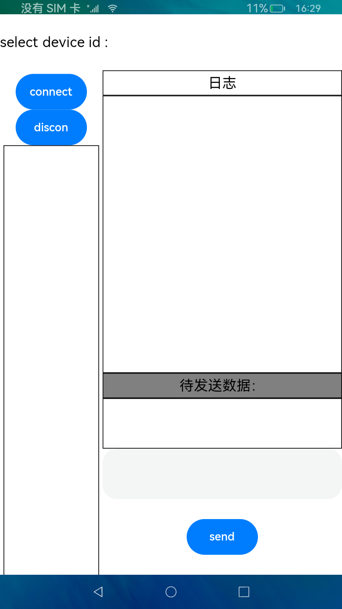

# Stage模型手工测试套示例

本示例展示了分布式调度子系统基于stage模型手工测试套，包含:

1、跨设备绑定ServiceExtensionAbility

效果图

## 跨设备绑定ServiceExtensionAbility示例

### 简介
本示例展示了在eTS中如何构建stage模型跨设备绑定ServiceExtensionAbility，包含:

1、远端实现待绑定 ServiceExtensionAbility

2、申请分布式权限：DISTRIBUTED_DATASYNC

3、发起端调用 context.connectAbility() 接口，传入 deviceId，bundleName，abilityName 绑定远端 ServiceExtensionAbility

4、绑定成功获取远端 ServiceExtensionAbility 句柄，发起端使用句柄的 sendRequest() 接口调用远端定义的方法

效果图

### 测试步骤
1、两台设备都安装此应用，并组网成功（计算器可以跨端拉起）

2、在设置里给予此应用分布式权限

3、发起端设备 A 打开应用，选择待绑定远端设备 B 的 deviceId，点击 connect 按钮发起绑定

4、发起端设备 A 日志区显示 “get proxy”，代表绑定成功

5、发起端设备 A 在输入栏输入任意字符串，点击 send 按钮，信息被发送到远端设备 B

6、发起端设备 A 收到远端设备 B 的回复消息 “MyServiceExtensionAbility receive your message”

### 约束与限制
1、本示例仅支持标准系统上运行

2、本示例为Stage模型，仅支持API version 9，IDE版本3.0.1.900以上，系统版本OpenHarmony3.1 release