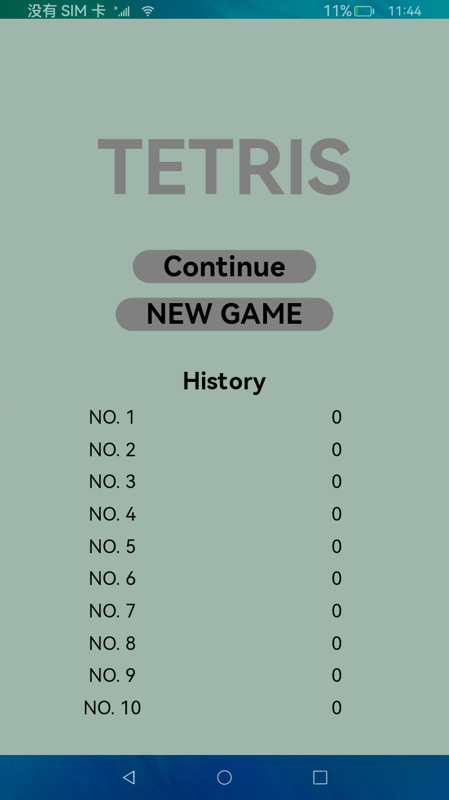
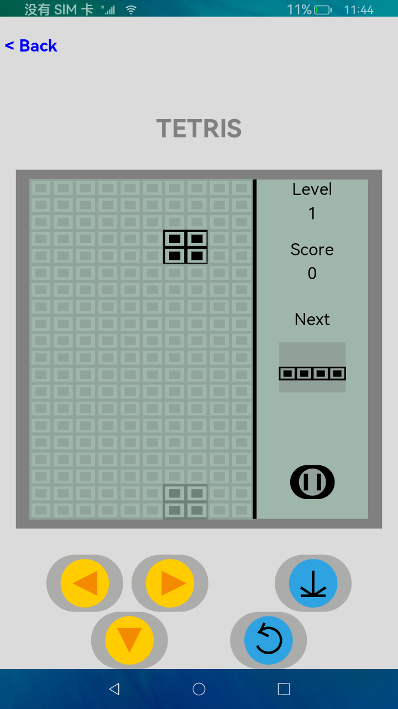

# 迁移跟踪体验-俄罗斯方块

### 简介
本示例展示了跨设备迁移跟踪体验的验证应用，包括：

1、游戏页面的带栈迁移。

2、游戏数据的跨设备迁移。

效果图

  

### 相关权限
允许跨设备数据同步：ohos.permission.DISTRIBUTED_DATASYNC。

### 使用说明
#### 验证数据迁移
1、两台设备组网

2、设备A打开游戏，出现权限授权弹窗，点击授权。

3、使用设备A点击“New Game”开始游戏。

4、设备A打开迁移入口应用，将本地游戏快照拖拽到设备B。

5、迁移成功，设备A游戏应用退出，设备B自动打开游戏应用，游戏应用的进行状态与设备A前一致，验证数据迁移成功。

6、使用设备B继续游戏。
#### 验证带栈迁移
1、设备B点击laucher的back按钮，游戏页面回退到主页面，验证页面栈迁移成功。

### 约束与限制
1、本示例仅支持标准系统上运行。

2、本示例为Stage模型，仅支持API version 9，IDE版本3.0.1.900以上。