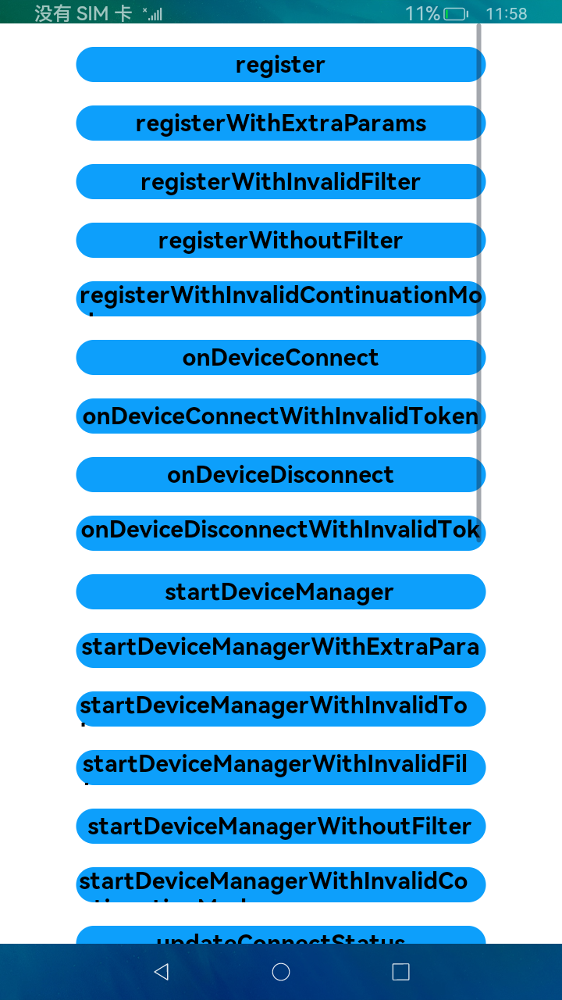

# ContinuationManager手工测试套

### 简介
本示例展示了ContinuationManager手工测试用例，包括：

1、传入正常值调用ContinuationManager接口

2、传入异常值调用ContinuationManager接口

3、使用ContinuationManager接口进行跨设备拉起以及绑定

效果图

### 测试步骤
1、两台设备都安装此应用，并组网成功（计算器可以跨端拉起）

2、对弹出的分布式权限弹框进行授权

3、点击startRemoteAbility按钮，弹出设备选择器应用

4、选择组网设备后，点击confirm按钮，远端设备应用被拉起，表示跨设备拉起成功

5、点击connectRemoteAbility按钮，弹出设备选择器应用

6、选择组网设备后，点击confirm按钮，本设备下方Toast显示“connectRemoteAbilityWithDeviceId connect result: 100”

### 约束与限制
1、本示例仅支持标准系统上运行。 2、本示例为Stage模型，仅支持API version 9，IDE版本3.0.1.900以上。